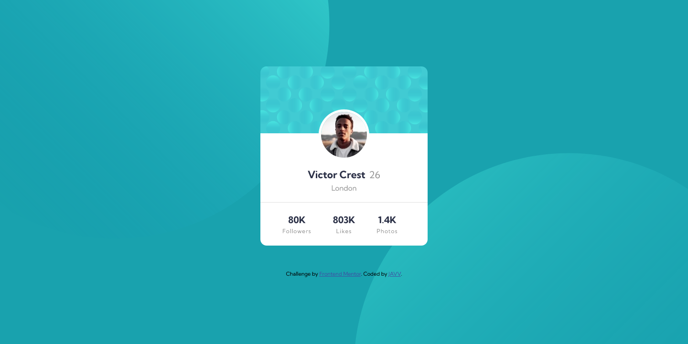
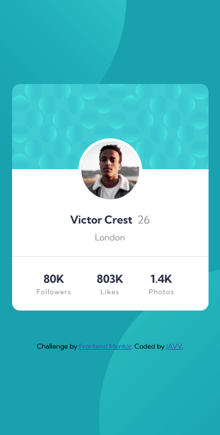

# Profile Card Component - Frontend Mentor


## Welcome! 👋

Hello everyone! 😁

This is my solution to the [Profile card component challenge on Frontend Mentor](https://www.frontendmentor.io/challenges/profile-card-component-cfArpWshJ).

## Table of contents

- [Overview](#overview)
  - [The challenge](#the-challenge)
  - [Screenshot](#screenshot)
  - [Links](#links)
- [My process](#my-process)
  - [Built with](#built-with)
  - [What I learned](#what-i-learned)
  - [Continued development](#continued-development)
  - [Useful resources](#useful-resources)
- [Author](#author)

## Overview

### The challenge

- Build out the project to the designs provided

### Screenshot




### Links

- Solution URL: [Github](https://github.com/daisukeeita/Profile-Card-Component)
- Live Site URL: [Profile Card Component](https://daisukeeita.github.io/Profile-Card-Component/)

## My process

### Built with

- Semantic HTML5 markup
- CSS custom properties
- Flexbox
- CSS Grid
- Mobile-first workflow

### What I learned

What I learned in this challenged is the manipulation of multiple `svg` for the background of the website. 

This is where I was actually stucked, because the sizes and the position of `svg` are need to set it manually. And I was not aware on how to set it up at first, thanks to the CSS-Tricks website I got the idea on how to position it especially offset it to the screen. 

```css
body {
    display: flex;
    flex-direction: column;
    justify-content: center;
    align-items: center;
    min-height: 100vh;
    text-rendering: optimizeSpeed;
    line-height: 1.5;
    background-image: 
        url(images/bg-pattern-top.svg),
        url(images/bg-pattern-bottom.svg);
    background-color: var(--primary-color-400);
    background-position: 
        top -255px left -290px,
        bottom -221px right -299px;
    background-repeat: no-repeat;
    background-size: 
        500px;
    overflow: hidden;
    font-family: var(--font-family-kumbhSans);
}
```

```css
@media screen and (min-width: 25rem) {
    body {
        background-position: 
        top -400px left -210px, 
        bottom -500px right -200px;
        background-size: 900px;
    }
}
```

### Continued development

I need to understand how to make the responsive size of the `svg` based on the given screen, this is what makes me feel incomplete in this challenge. 

### Useful resources

- [CSS-Tricks](https://css-tricks.com/css-basics-using-multiple-backgrounds/) - This website is what helped me give an idea on how to manipulate multiple `svg` as well as use multiple `svg` as background. 

## Author

- Frontend Mentor - [@daisukeeita](https://www.frontendmentor.io/profile/daisukeeita)